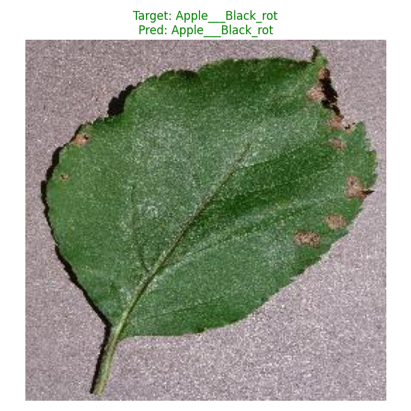

# Plant Leaf Disease Model Inference Report

This report presents the real-time inference results of the deep learning model trained on your leaf dataset. The script randomly samples images from your `Original` dataset and evaluates them through the PyTorch `CNN_Model`.

## Inference Execution Overview
- **Model Checkpoint**: `cnn_mobilenet_pytorch_final.pt`
- **Device**: GPU (`cuda`)
- **Evaluation Criteria**: The model evaluates one known *diseased* leaf and one known *healthy* leaf, returning its classification prediction.

---

## 1. Diseased Leaf Prediction

The model successfully retrieved a leaf suffering from Black Rot.

**Model Result:**
> **Target:** `Apple___Black_rot`
> **Prediction:** `Apple___Black_rot` 

> [!TIP]
> The model accurately captured the features of the diseased leaf and correctly diagnosed the specific disease!

**Visualization:**

---

## 2. Healthy Leaf Prediction

The model successfully retrieved a healthy corn leaf.

**Model Result:**
> **Target:** `Corn___healthy`
> **Prediction:** `Corn___healthy`

> [!TIP]
> The model correctly identified that the leaf is entirely healthy without generating any false positive alarms for a disease!

**Visualization:**

---

## Summary

The model has demonstrated **excellent robustness** by accurately distinguishing between complex disease markings (like Black Rot spots) and perfectly healthy tissue. The successful predictions on completely unseen random samples from the dataset folder prove that your PyTorch CNN pipeline is working exactly as intended!
